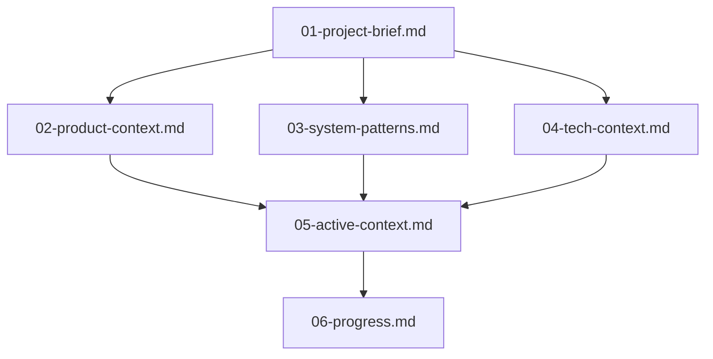
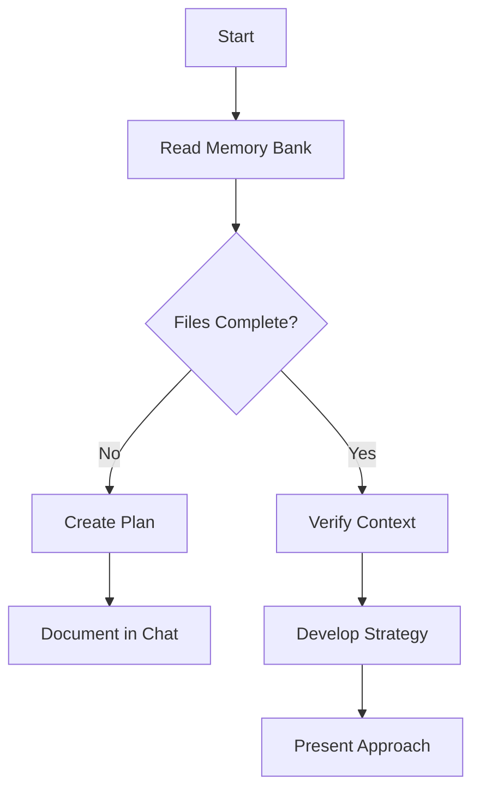
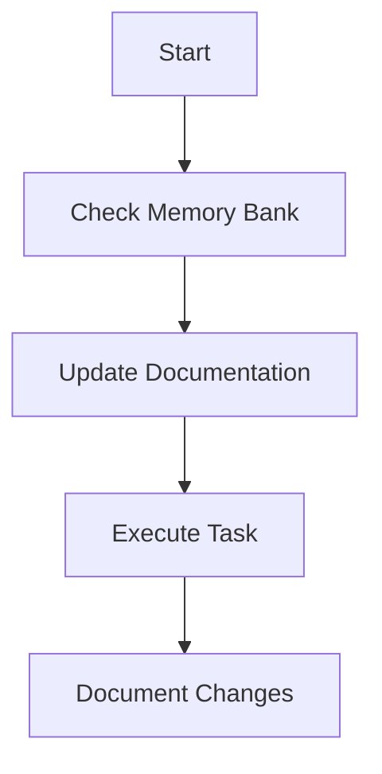

# Memory Bank

The memory bank is the central repository for all project knowledge, serving as a source of information for AI code assistants (and human developers) to understand the project context, requirements, and progress. It is designed to be comprehensive and up-to-date, ensuring that AI agents can effectively continue development without losing context or information.

## Memory Bank Structure

The Memory Bank consists of core files organized in a numbered sequence, all in Markdown format. Files build upon each other in a clear hierarchy:



### Core Files (Required)

Located in `docs/memory-bank/`:

1. `01-project-brief.md`

   - Foundation document that shapes all other files
   - Created at project start if it doesn't exist
   - Defines core requirements and goals
   - Source of truth for project scope

2. `02-product-context.md`

   - Why this project exists
   - Problems it solves
   - How it should work
   - User experience goals

3. `03-system-patterns.md`

   - System architecture and 6-layer pattern
   - Key technical decisions and implementation patterns
   - Design patterns in use, testing strategies
   - Component relationships and file naming conventions
   - Critical implementation paths and development workflows

4. `04-tech-context.md`

   - Technologies used and development setup
   - Technical constraints and dependencies
   - Tool usage patterns and build processes

5. `05-active-context.md`

   - Current work focus and recent changes
   - Next steps and active decisions
   - Important patterns and preferences
   - Learnings and project insights

6. `06-progress.md`
   - What works and what's left to build
   - Current status and known issues
   - Evolution of project decisions

### Additional Context

#### Student-Focused Guides

Located in `docs/guides/`. For example:

- `docker.md` - Detailed Docker explanation for students learning containerization
- `vscode.md` - VS Code setup and debugging configuration for students

#### Future Extensions

Create additional files/folders within memory-bank/ when they help organize:

- Complex feature documentation
- Integration specifications
- API documentation
- Advanced deployment procedures

## Core Workflows

### Plan Mode



### Act Mode



## Documentation Updates

Memory Bank updates occur when:

1. Discovering new project patterns
2. After implementing significant changes
3. When context needs clarification

   ```mermaid
   flowchart TD
      Start[Update Process]

      subgraph Process
         P1[Review ALL Files]
         P2[Document Current State]
         P3[Clarify Next Steps]
         P4[Document Insights & Patterns]

         P1 --> P2 --> P3 --> P4
      end

      Start --> Process
   ```

> [!NOTE]
> A slightly edited version of this document is provided as guideline to Cline.bot (through the `.clinerules` file) and to Cursor (through the `.cursor/rules/memory.mdc` file) to help them understand how to use the Memory Bank effectively. The AI agents will follow these guidelines when interacting with the Memory Bank, ensuring they maintain context and provide accurate responses based on the project's knowledge base.
