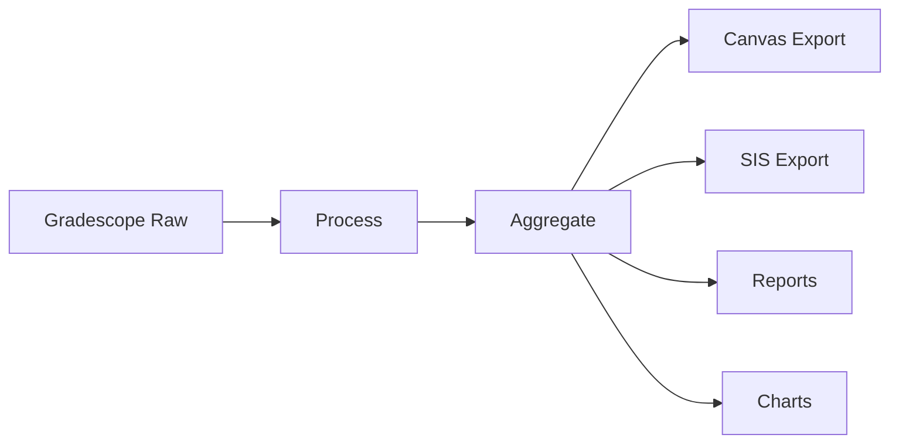
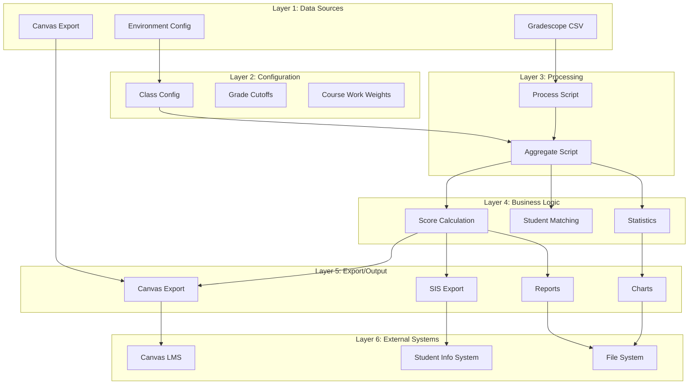

# System Patterns: Grade Book

## System Architecture

### Core Design Pattern: Pipeline Architecture

The Grade Book follows a **linear pipeline architecture** where data flows through distinct processing stages:



Each stage is:

- **Independent**: Can be run separately for testing/debugging
- **Idempotent**: Running multiple times produces same result
- **Traceable**: Generates intermediate files for audit trail

### 6-Layer System Pattern



## Key Technical Decisions

### File Organization Strategy

- **Data Isolation**: Each class gets its own folder in `data/`
- **Configuration Co-location**: Class-specific config lives with data
- **Source Code Separation**: All processing logic in `src/`
- **Documentation Centralization**: All docs in `docs/`

### Data Flow Patterns

#### Immutable Data Pipeline

- **Never modify source files**: Original exports remain untouched
- **Generate intermediate files**: Each stage creates new files
- **Preserve audit trail**: All transformations are traceable

#### Error Handling Strategy

- **Fail fast**: Stop processing on critical errors
- **Generate error reports**: Create JSON files for manual review
- **Graceful degradation**: Continue processing when possible

### Configuration Management

#### Environment-Based Class Selection

```typescript
// src/config.ts pattern
export const CURRENT_CLASS = process.env.CURRENT_CLASS;
```

#### Type-Safe Configuration

```typescript
// Class config pattern
export type COURSE_WORK = {
  name: string;
  assignments: string[];
  weight: number;
  max_points?: number;
};
```

## Implementation Patterns

### Script Structure Pattern

Each processing script follows this pattern:

```typescript
// 1. Load configuration
async function loadClassConfig() {
  /* ... */
}

// 2. Read input files
const inputData = await readCSV(inputPath);

// 3. Process data
const processedData = transformData(inputData);

// 4. Generate outputs
await writeCSV(outputPath, processedData);
await writeJSON(metaPath, metadata);

// 5. Error reporting
if (errors.length > 0) {
  await writeJSON(errorPath, errors);
}
```

### File Naming Conventions

#### Input Files (Manual)

- `gradescope_raw.csv` - Direct export from Gradescope
- `canvas_export.csv` - Direct export from Canvas
- `config.ts` - Class-specific configuration

#### Generated Files (Automated)

- `gradescope_processed.csv` - Cleaned Gradescope data
- `gradescope_meta.json` - Assignment metadata
- `grades.csv` - Final aggregated grades
- `metrics.json` - Statistical analysis
- `canvas_import.csv` - Canvas-ready import file
- `canvas_errors.json` - Student matching errors
- `sis_import.xlsx` - SIS-ready Excel file

#### Reports and Visualizations

- `reports/${name}_${email}.md` - Individual student reports
- `grade_distribution.png` - Class grade distribution chart

### Data Transformation Patterns

#### CSV Processing Pattern

```typescript
import { parse } from "csv-parse/sync";
import { stringify } from "csv-stringify/sync";

// Read CSV with headers
const records = parse(csvContent, {
  columns: true,
  skip_empty_lines: true,
});

// Transform data
const transformed = records.map(transformRecord);

// Write CSV with headers
const output = stringify(transformed, { header: true });
```

#### Student Matching Pattern

```typescript
// Match students between systems using SID
const matchedStudents = canvasStudents.map((canvasStudent) => {
  const gradeStudent = gradeData.find(
    (grade) => grade.SID === canvasStudent["SIS User ID"],
  );
  return { canvasStudent, gradeStudent };
});
```

### Statistical Calculation Patterns

#### Utility Functions

```typescript
function mean(arr: number[]): number;
function median(arr: number[]): number;
function stddev(arr: number[]): number;
function min(arr: number[]): number;
function max(arr: number[]): number;
```

#### Grade Distribution Analysis

```typescript
const distribution = Object.entries(CLASS_GRADE_CUTOFFS).map(
  ([grade, cutoff]) => ({
    grade,
    count: students.filter((s) => s.letterGrade === grade).length,
    percentage: (count / totalStudents) * 100,
  }),
);
```

## Testing Strategies

### Manual Testing Approach

- **Sample Data**: Use small, known datasets for verification
- **Cross-Validation**: Compare results with manual calculations
- **Edge Case Testing**: Test with missing data, zero scores, etc.

### Validation Patterns

- **Data Integrity Checks**: Verify student counts match across files
- **Calculation Verification**: Spot-check weighted grade calculations
- **Format Validation**: Ensure export files match expected formats

## Development Workflows

### Adding New Features

1. **Update Configuration Types**: Modify type definitions if needed
2. **Implement Processing Logic**: Add to appropriate script
3. **Update Documentation**: Reflect changes in README and memory bank
4. **Test with Sample Data**: Verify with known course data

### Debugging Workflow

1. **Check Intermediate Files**: Examine generated JSON/CSV files
2. **Validate Configuration**: Ensure class config matches assignments
3. **Review Error Reports**: Check generated error JSON files
4. **Manual Verification**: Compare subset of calculations manually

### Deployment Pattern

- **No formal deployment**: Scripts run locally on instructor machines
- **Version Control**: Git for source code, data folders ignored
- **Documentation**: README provides complete setup instructions

## Critical Implementation Paths

### Grade Calculation Path

```plaintext
Gradescope Raw → Process → Aggregate → Weighted Scores → Letter Grades
```

### Export Generation Path

```plaintext
Aggregated Grades → Student Matching → Format Conversion → Export Files
```

### Error Handling Path

```plaintext
Data Inconsistency → Error Detection → JSON Report → Manual Resolution
```

## Component Relationships

### Core Scripts Dependencies

- `process.ts` → `gradescope_raw.csv`
- `aggregate.ts` → `gradescope_processed.csv` + `config.ts`
- `canvas.ts` → `grades.csv` + `canvas_export.csv`
- `sis.ts` → `grades.csv`
- `report.ts` → `grades.csv` + `gradescope_processed.csv`
- `chart.ts` → `metrics.json`

### Configuration Dependencies

- All scripts depend on `CURRENT_CLASS` environment variable
- Processing scripts require class-specific `config.ts`
- Export scripts require external system exports

### Example Scripts Dependencies

- `examples/combine_sections_assignments.ts` → `gradescope_processed.csv`
- `examples/remove_audit_students.ts` → `gradescope_processed.csv` + `audit.csv` (planned)
- Example scripts follow same patterns as core scripts but for specialized data transformations
